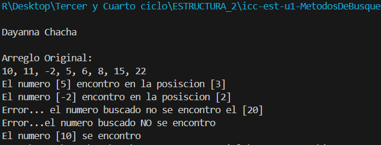
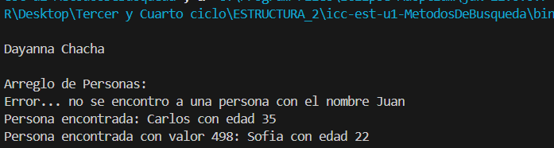

# 🧩 ESTRUCTURA DE DATOS

**Nombre del Estudiante:** Janelly Dayanna Chacha Vélez  

## 🧠 Busqueda Lineal

**Fecha:** Práctica 6 – 6 de Noviembre

### Busqueda Lineal en Java

### Busqueda lienal de personas en Java
